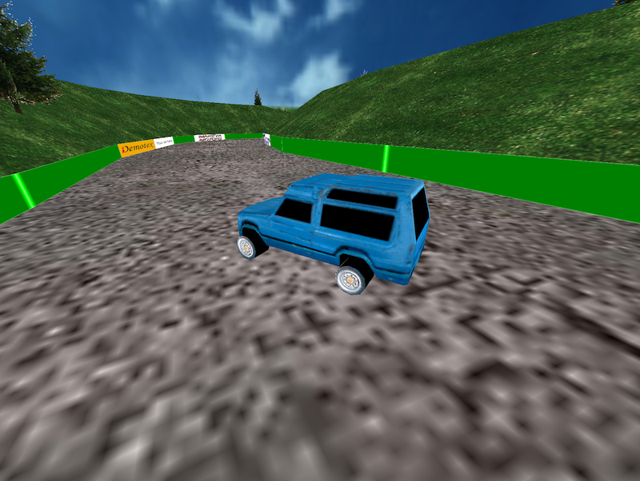

# Rally MKA

A really old game project of mine ported to Go for fun.

## Remarks

Being a port of a very old project of mine, some remarks are in place.

* Though some parts of the code I have rewritten entirely, others I have left as they were originally. Hence, nasty variable names and difficult to follow through formulas are to be expected. The project was originally written in Delphi, back when 'clean code' wasn't something I was aware of.
* The physics of the car is whacky. Yes, I know. It was meant to be that way when I wrote it - I wanted a strange rally type of drift feel. Still, you will see that some effort was spent in getting wheels to turn correctly, taking angle and speed into account. Someone later pointed out to me that I had implemented a hovercraft-type of physics. Interesting...
* I have done little to no editing on the art. It is as it was modeled originally.
* There is a lot of resource trashing going on. I could have done a better job at OpenGL resource allocation and reuse but I wanted to get a working port as quickly as possible.

## Running

If you want to compile the project and run it yourself, follow these steps.

* Follow the steps on the [GLFW for Go](https://github.com/go-gl/glfw) project.
* Make sure the [GLFW examples](https://github.com/go-gl/example) are running on your computer.
* Do a `go get github.com/mokiat/rally-mka`.
* Run the project via `cd $GOPATH/src/github.com/mokiat/rally-mka; go run main.go`. This assures that the current working directory is the project root folder, otherwise assets will not load.

## Licensing

### Code

All source code in this project is licensed under [Apache License v2](LICENSE).

### Assets

All art assets (models, textures, etc.) are distributed under the [Creative Commons Attribution 4.0 International](http://creativecommons.org/licenses/by/4.0/) license.
