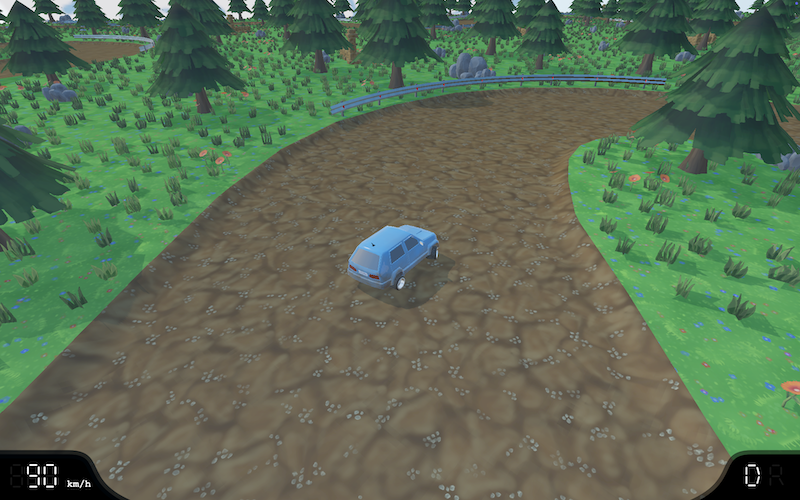

# Rally MKA

A really old game of mine ported to Go for fun.



## Remarks

Being a port of a very old project of mine, some remarks are in place.

* Though some parts of the code I have rewritten entirely, others I have left as they were originally. Hence, nasty variable names and difficult to follow through formulas are to be expected. The project was originally written in Delphi, back when 'clean code' wasn't something I was aware of.
* The physics of the car is whacky. Yes, I know. It was meant to be that way when I wrote it - I wanted a strange rally type of drift feel. Still, you will see that some effort was spent in getting wheels to turn correctly, taking angle and speed into account. Someone later pointed out to me that I had implemented a hovercraft-type of physics. Interesting...
* I have done little to no editing on the art. It is as it was modeled originally.
* There is a lot of resource thrashing going on. I could have done a better job at OpenGL resource allocation and reuse but I wanted to get a working port as quickly as possible.

## Getting Started

If you are using a MacOS system, the easiest way to get the game running is to download the app from the releases section of the GitHub project.

If you want to compile the project and run it yourself, follow these steps.

0. Follow the steps listed in the [GLFW for Go](https://github.com/go-gl/glfw) project.
0. Make sure you can run the [GLFW examples](https://github.com/go-gl/example) on your computer.
0. Clone the project somewhere on your filesystem (make sure you have Git LFS installed).
    ```bash
    git clone https://github.com/mokiat/rally-mka
    cd rally-mka
    ```
0. Download project dependencies
    ```bash
    go mod download
    ```
0. Install Rally File Format Tool
    ```bash
    (cd cmd/rff && go install)
    ```
0. Generate all assets
    ```bash
    scripts/generate
    ```
0. Run the game
    ```bash
    go run cmd/rallymka/main.go
    ```

## Licensing

### Code

All source code in this project is licensed under [Apache License v2](LICENSE).

### Assets

All art assets (images, models, textures, etc.) are distributed under the [Creative Commons Attribution 4.0 International](http://creativecommons.org/licenses/by/4.0/) license.

## Special Thanks

* **[Bo0mer](https://github.com/Bo0mer)** for the original panoramic image that was used to generate the individual `city` skybox images.
